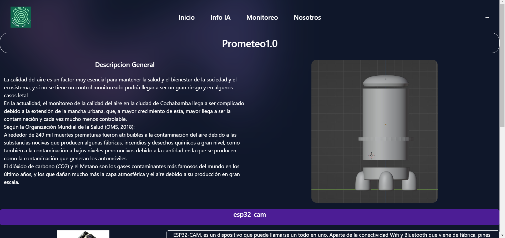
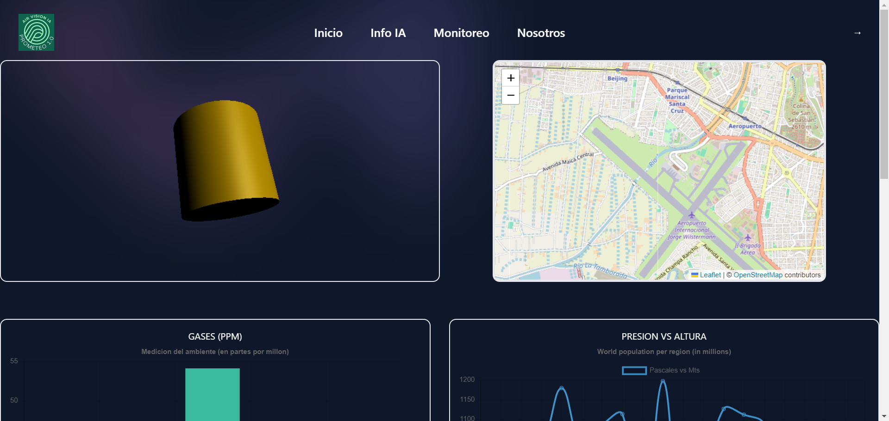
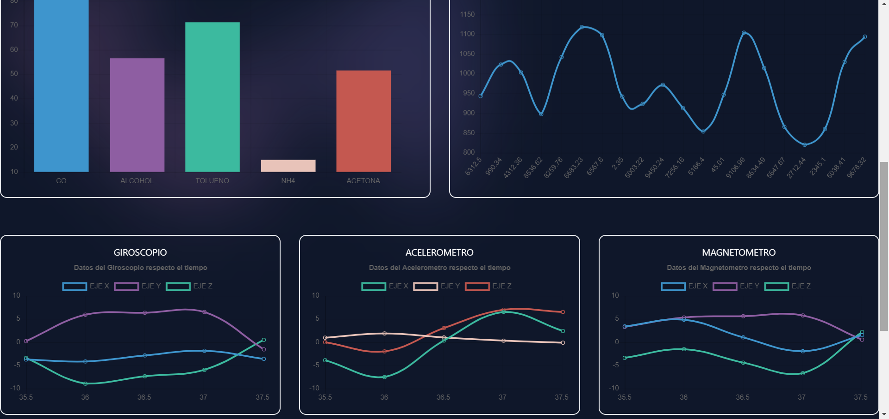

# Cansat - Prometeus

## Descripción
Este proyecto fue desarrollado para el Concurso Nacional de Nanosatelites 2023, por el grupo La caja de Pandora (2do Lugar).

Consta de una pagina web donde se pueden visualizar los datos que llegan desde el Cansat hasta nuestra base de datos en Mongo DB.

El proyecto contiene el backend desarrollado en Python con Flask y Pymongo, ademas del frontend desarrollado en React con la libreria ChartJs para mostrar las graficas mas representativas de los datos.

## Características
- Pagina de Control de calidad del Aire.
- API desarrollada en Flask.
- 2do Lugar del Concurso Nacional de Nanosatelites (CANSAT) Bolivia 2023.

## Instrucciones de Uso
### Frontend (React)

1. Abra la terminal y navegue a la carpeta del Frontend: `cd frontend`.
2. Instale las dependencias utilizando el comando: `npm install`.

### Backend (Flask)

1. Abra otra terminal y navegue a la carpeta del Backend: `cd backend`.
2. Instale las librerías necesarias ejecutando: `pip install -r requirements.txt`.

### Ejecución

1. En la terminal del Frontend, ejecute el proyecto React con el comando: `npm run dev`.
2. En la terminal del Backend, inicie el servidor Flask con: `python main.py`.

## Dependencias
Las dependecias estan en el mismo repositorio.

## Imagenes

    
    

## Licencia
Este proyecto está bajo la Licencia MIT. Consulta el archivo [LICENSE](LICENSE) para obtener más detalles.

---

